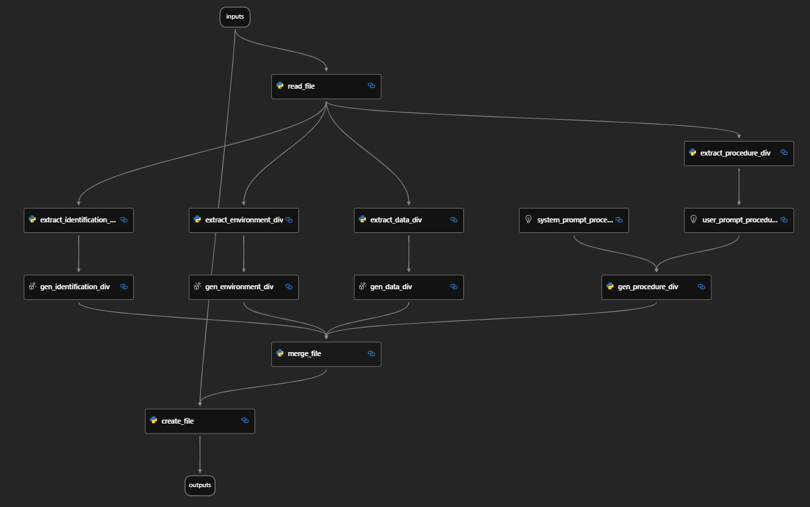

# code-to-docs-flow
本リポジトリにあるコードは、COBOL のファイルからドキュメントを生成するサンプルのプロンプトフローです。

## 前提
- 入力される COBOL のファイルは、以下の 4 つの division から構成されているものとします。
    - IDENTIFICATION DIVISION
    - ENVIRONMENT DIVISION
    - DATA DIVISION
    - PROCEDURE DIVISION

## 利用手順
- `flow.dag.yaml` の `inputs.storage_account.default` の `connection_string`, `container_name`, `blob_name` を設定
- `flow.dag.yaml` からデバッグやフローの実行
